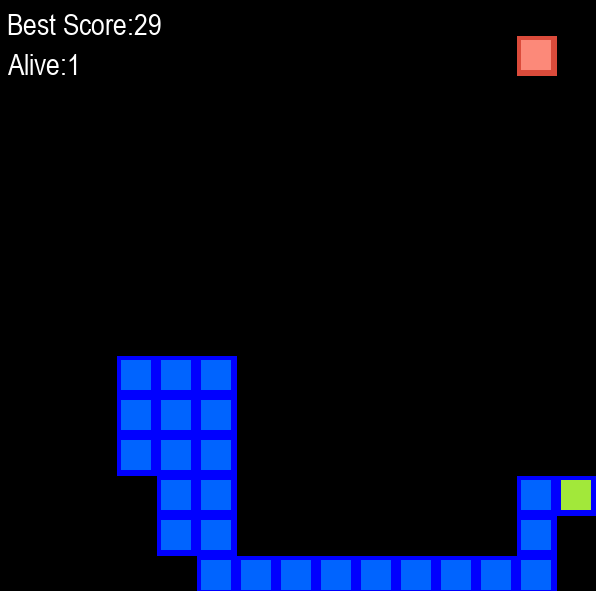

# Neat Snake

## The Neat Algorithm

Neat is a genetic algorithm that creates artificial neural networks (NN). The solution to the problem is given by a fitness function provided by the user. In this project, Neat was used to teach the AI how to play the regular snake game, in which the fitness function rewards the snake for eating apples and staying alive, and penalizes it for dying (biting its tail or the wall). The most fit individuals of each generation are selected to reproduce and pass its NN parameters to their children, similar to actual natural selection.

> Snake game.

## How it works

A population of 1000 snakes start with random parameters and their AI is improved by each generation. In this project, the snakes don't compete with each other, since they have their own apples and there is no "friendly fire".

> 25th generation.

The following graph shows the AI evolution through time, as its average fitness increases alongside the generation.

> Fitness per generation.

---

## How To Use

### Run with no requirements

You can run the code directly from your browser with Gitpod, a free online dev enviroment for Github.

### Run on your machine

To run the code locally, you'll need to download this repo, install python3 and the following dependencies:

<ul>
<li>numpy<li\>
<li>pygame<li\>
<li>neat-python<li\>
<li>graphviz<li\>
<li>matplotlib<li\>
<ul\>

Then, simply run the snake_game.py file.
